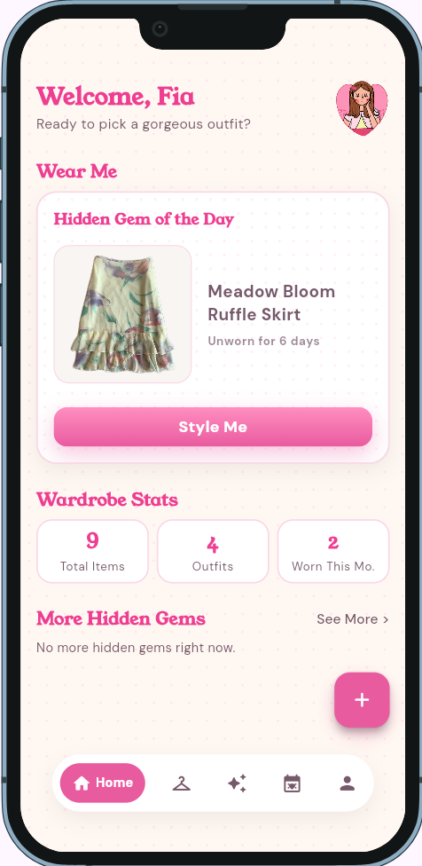
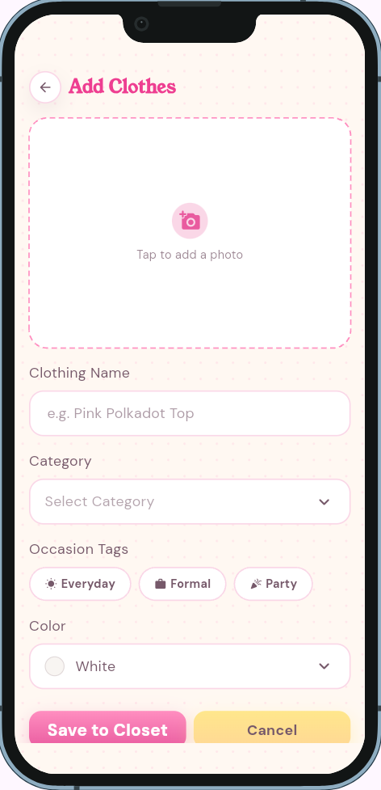

# Love My Closet

> Love My Closet is a digital wardrobe app that helps college students and young professionals organize their clothes, plan outfits, and rediscover pieces they rarely wear.

*You own it. You just forgot you do.*

**Live demo:** <https://sofiademesa.github.io/love-my-closet/>
**Demo video:** [docs/demo.mp4](docs/demo.mp4)
**Course:** Applications Development and Emerging Technologies (6ADET), Holy Angel University
**Author:** Sofia Ryza D. De Mesa

This repository contains the final project developed for 6ADET. It is public for academic evaluation and portfolio purposes.

---

## Screenshots

| Home | Detail | Add |
| --- | --- | --- |
|  |  |  |

## What it does

Love My Closet helps users get more out of the clothes they already own. Here is what you can do on each screen.

**Onboarding and accounts**
- Landing page and two intro slides that explain the app.
- Create an account and confirm your email with a 6-digit code.
- Log in, reset a forgotten password, and set a new one.
- Every closet is private to its owner.

**Home**
- A greeting and a **Wear Me** card that suggests a piece you haven't worn in a while.
- **Wardrobe Stats**: total items and total outfits.
- **More Hidden Gems**, with a full Hidden Gems sheet: pieces waiting for their moment again.

**Closet**
- Browse every piece you own as cards.
- Filter by category (Tops, Bottoms, Dresses, Outerwear, Shoes, Accessories), occasion, color, and Favorites.
- Search by name.
- Delete items you no longer want.

**Add Clothes**
- Take a photo or choose one from your gallery.
- The background is removed automatically, on your device, so each piece looks clean.
- Set the item's name, category, occasion, and color.

**Item Detail and Edit**
- View a piece's photo and details.
- Mark it as a favorite, edit it, or delete it.

**Outfit Builder**
- Place pieces from your closet on a board.
- Move and resize each piece to style the look.
- Save the look with a name and, if you want, a date.

**Calendar and Outfit Diary**
- A monthly calendar of the outfits you logged.
- Log an outfit for a date and add a diary note.
- Tap a day to see the outfit and edit its details.

**Profile**
- Edit your profile (display name, full name, bio).
- **Accessibility:** text size, reduce motion, and high contrast.
- **Hidden Gems Threshold:** choose how long a piece must go unworn to count as a hidden gem.
- Turn notifications on or off.
- About and Help & Support, and log out.

## Built with

| | |
| --- | --- |
| Framework | Flutter (web and mobile) |
| Language | Dart |
| State management | `setState` |
| Backend | Supabase: Auth (accounts), Postgres (data), Storage (private photos) |
| Data security | Supabase Row Level Security (RLS) |
| Background removal | `silueta` (a size-reduced U²-Net model) running on-device in the browser with ONNX Runtime Web |
| Packages | `supabase_flutter` (backend), `image_picker` (camera and gallery), `url_launcher` (links on the About screen), `device_preview` (phone-frame preview while developing) |
| Design | Figma |
| Typography | Young Serif (headings), DM Sans (body) |
| Deployment | GitHub Actions to GitHub Pages |
| Version control | Git and GitHub |

## Running it yourself

> Just want to try the app? Use the [live demo](https://sofiademesa.github.io/love-my-closet/). The steps below are only for running your own copy, which needs your own free Supabase project.

Requires Flutter with Dart SDK `^3.8.0` (Flutter 3.32 or newer). Check yours with `flutter --version`.

1. **Set up Supabase.** Follow [`supabase/README.md`](supabase/README.md): create a project, run the SQL migrations in [`supabase/migrations/`](supabase/migrations/), and set the auth redirect URLs.
2. **Clone and install:**

   ```bash
   git clone https://github.com/sofiademesa/love-my-closet.git
   cd love-my-closet
   flutter pub get
   ```

3. **Add your keys.** Create an `env.json` file in the project root. It is git-ignored, so never commit it:

   ```json
   {
     "SUPABASE_URL": "https://xxxx.supabase.co",
     "SUPABASE_PUBLISHABLE_KEY": "sb_publishable_..."
   }
   ```

4. **Run it:**

   ```bash
   flutter run -d chrome --web-port 5000 --dart-define-from-file=env.json
   ```

### Environment variables

| Variable | What it is | Where to get one |
| --- | --- | --- |
| `SUPABASE_URL` | The URL of your Supabase project | Supabase dashboard → Project Settings → API |
| `SUPABASE_PUBLISHABLE_KEY` | Public publishable (anon) key, safe to use because RLS protects the data | Supabase dashboard → Project Settings → API Keys |

Never use the secret / `service_role` key in the app. It is not needed, and the app refuses to start if it is given one. The deploy workflow reads the same two names from repository secrets.

## Privacy and secrets

Love My Closet stores only what its features need: your account (email and password, handled by Supabase Auth), a profile (display name, full name, bio, and settings), your clothing details, outfits, diary notes, and the photos of your clothes. This data lives in Supabase.

Photos are kept in a private storage bucket, and Row Level Security means each account can only read and change its own data. This is checked by an isolation test in [`supabase/tests/rls_isolation_test.sql`](supabase/tests/rls_isolation_test.sql). Background removal runs on the user's own device, so photos are never sent to a third-party service.

No secrets are committed. Local keys live in a git-ignored `env.json`, and the deployed site gets its values from GitHub repository secrets. The Supabase URL and publishable key are public by design and are only safe because RLS is enabled. The secret key is never used.

The screenshots, demo video, and sample data use test accounts and sample clothing only, with no real personal information or passwords.

## Project documentation

| Document | |
| --- | --- |
| [Proposal](docs/01-proposal.md) | the problem, the users, the scope |
| [Mockup and wireframes](docs/02-mockup.md) | what it looks like, and the screen flow |
| [Design system](docs/03-design-system.md) | colors, type, spacing, components |
| [Weekly reports](docs/04-weekly-reports.md) | what happened each week |
| [Demo video](docs/05-demo-video.md) | the recording and what it shows |
| [Security and privacy](docs/06-security-and-privacy.md) | the checklist, filled in |
| [Supabase backend](supabase/README.md) | setup, data model, and the RLS isolation test |

## Status and what is next

The app is complete and deployed. Accounts, the closet, background removal, the Outfit Builder, the Calendar and Outfit Diary, Hidden Gems, and the profile settings all work end to end.

**Known issues**
- Supabase's built-in email sender is rate-limited to a few emails per hour, so sign-up confirmation emails can be slow or limited when many people sign up at once. A custom SMTP sender would fix this.

**What I would build next**
- Smart outfit recommendations
- Weather-based outfit suggestions
- A customizable personal avatar

## Credits

- Framework and language: Flutter and Dart
- UI/UX design and prototyping: Sofia Ryza D. De Mesa, in Figma
- Background removal model: `silueta`, a size-reduced version of [U²-Net](https://github.com/xuebinqin/U-2-Net) (by Xuebin Qin et al., Apache-2.0), published by the [rembg](https://github.com/danielgatis/rembg) project (by Daniel Gatis, MIT)
- In-browser inference: [ONNX Runtime Web](https://www.npmjs.com/package/onnxruntime-web) 1.30.0 (Microsoft, MIT). Full notices are in [`web/bg_removal/THIRD_PARTY_NOTICES.md`](web/bg_removal/THIRD_PARTY_NOTICES.md)
- Fonts: Young Serif and DM Sans (SIL Open Font License)
- Packages and dependencies: see [`pubspec.yaml`](pubspec.yaml)

## AI use


AI tools were used as learning and development aids. **Claude** was the main assistant, used to guide and write much of the Flutter and Dart code, which I directed and checked against my Figma designs. **ChatGPT** and **Gemini** were used for troubleshooting, explaining technical concepts, and helping with documentation write-ups. The final code, design decisions, features, and documentation were reviewed, adapted, and finalized by me.

Full account: [AI-USAGE.md](AI-USAGE.md)

## Licence

MIT, see [LICENSE](LICENSE).
