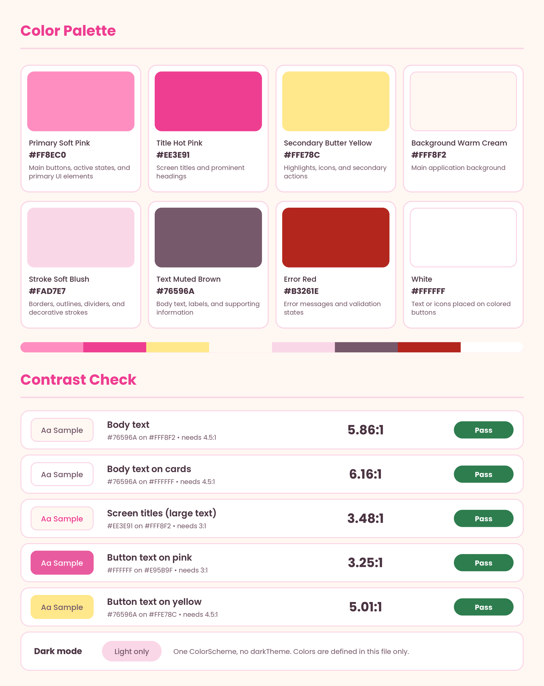
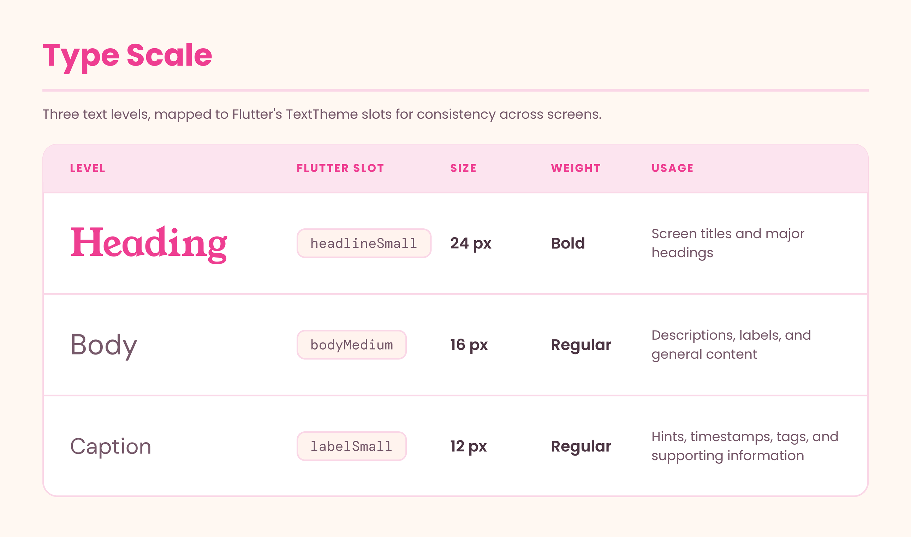
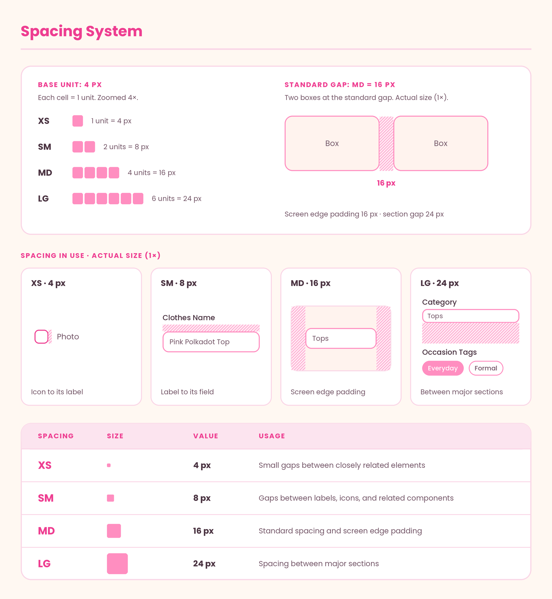
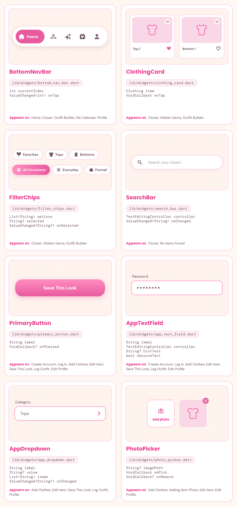
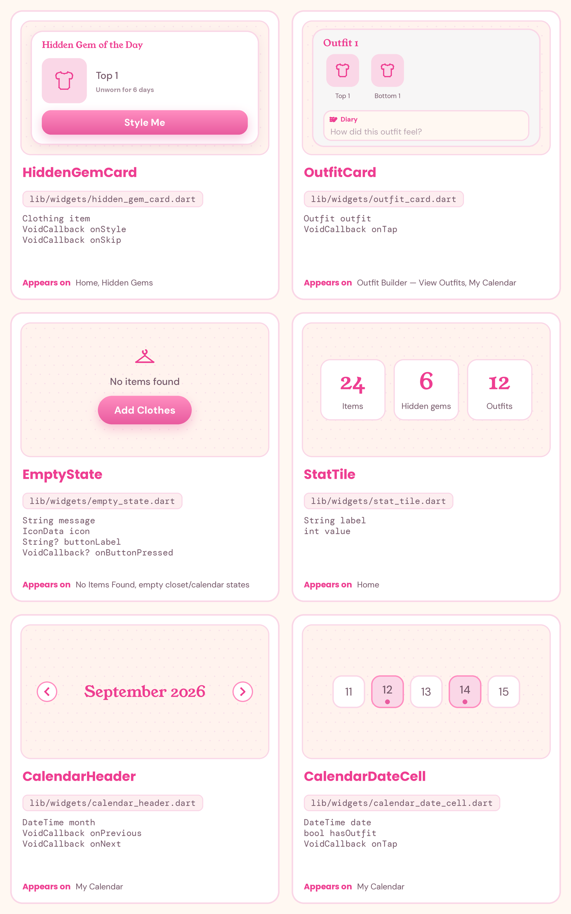

## Design system

*AI Disclosure: Claude AI was used to generate the visual layout of the design system graphics. All color selections, typography choices, spacing values, component structure, and overall design decisions are my own.*

### Palette

| Color | Hex | Usage |
|---|---|---|
| Primary Soft Pink | `#FF8EC0` | Main buttons, active states, primary UI elements |
| Title Hot Pink | `#EE3E91` | Screen titles and prominent headings |
| Secondary Butter Yellow | `#FFE78C` | Highlights, icons, secondary actions |
| Background Warm Cream | `#FFF8F2` | Main application background |
| Stroke Soft Blush | `#FAD7E7` | Borders, outlines, dividers, decorative strokes |
| Text Muted Brown | `#76596A` | Body text, labels, supporting information |
| Error Red | `#B3261E` | Error messages and validation states |
| White | `#FFFFFF` | Text or icons placed on colored buttons |

Buttons use `buttonPink` (`#E95B9F`) with white text, which passes contrast at 3.25:1 for bold large text. Light theme only: one `ColorScheme`, no `darkTheme`.

### Type scale

Fonts: Young Serif (headings), DM Sans (body, caption).

| Level | Flutter slot | Size | Weight | Usage |
|---|---|---|---|---|
| Heading | `headlineSmall` | 24 px | Bold | Screen titles and major headings |
| Body | `bodyMedium` | 16 px | Regular | Descriptions, labels, and general content |
| Caption | `labelSmall` | 12 px | Regular | Hints, timestamps, tags, and supporting information |

### Spacing

4 px base unit, defined in the `Spacing` class in `lib/theme.dart`.

| Name | Value | Usage |
|---|---|---|
| XS | 4 px | Small gaps between closely related elements |
| SM | 8 px | Gaps between labels, icons, and related components |
| MD | 16 px | Standard spacing and screen edge padding |
| LG | 24 px | Spacing between major sections |

### Components

| Component | File | Parameters | Used on |
|---|---|---|---|
| BottomNavBar | `lib/widgets/bottom_nav_bar.dart` | `int currentIndex`, `ValueChanged<int> onTap` | Home, Closet, Outfit Builder, My Calendar, Profile |
| ClothingCard | `lib/widgets/clothing_card.dart` | `Clothing item`, `VoidCallback onTap` | Closet, Hidden Gems, Outfit Builder |
| FilterChips | `lib/widgets/filter_chips.dart` | `List<String> options`, `String? selected`, `ValueChanged<String?> onSelected` | Closet, Hidden Gems, Outfit Builder |
| SearchBar | `lib/widgets/search_bar.dart` | `TextEditingController controller`, `ValueChanged<String> onChanged` | Closet, No Items Found |
| PrimaryButton | `lib/widgets/primary_button.dart` | `String label`, `VoidCallback? onPressed` | Create Account, Log In, Add Clothes, Edit Item, Save This Look, Log Outfit, Edit Profile |
| AppTextField | `lib/widgets/app_text_field.dart` | `String label`, `TextEditingController controller`, `String? hintText`, `bool obscureText` | Create Account, Log In, Add Clothes, Edit Item, Save This Look, Log Outfit, Edit Profile |
| AppDropdown | `lib/widgets/app_dropdown.dart` | `String label`, `String? value`, `List<String> items`, `ValueChanged<String?> onChanged` | Add Clothes, Edit Item, Save This Look, Log Outfit, Profile |
| PhotoPicker | `lib/widgets/photo_picker.dart` | `String? imagePath`, `VoidCallback onPick`, `VoidCallback? onRemove` | Add Clothes, Adding Item Photo, Edit Item, Edit Profile |
| HiddenGemCard | `lib/widgets/hidden_gem_card.dart` | `Clothing item`, `VoidCallback onStyle`, `VoidCallback onSkip` | Home, Hidden Gems |
| OutfitCard | `lib/widgets/outfit_card.dart` | `Outfit outfit`, `VoidCallback onTap` | Outfit Builder (View Outfits), My Calendar |
| EmptyState | `lib/widgets/empty_state.dart` | `String message`, `IconData icon`, `String? buttonLabel`, `VoidCallback? onButtonPressed` | No Items Found, empty closet/calendar states |
| StatTile | `lib/widgets/stat_tile.dart` | `String label`, `int value` | Home |
| CalendarHeader | `lib/widgets/calendar_header.dart` | `DateTime month`, `VoidCallback onPrevious`, `VoidCallback onNext` | My Calendar |
| CalendarDateCell | `lib/widgets/calendar_date_cell.dart` | `DateTime date`, `bool hasOutfit`, `VoidCallback onTap` | My Calendar |

The assembled `ThemeData` (colors, text theme, card and button themes) lives in `lib/theme.dart`.

### Changes since the last version

| Element | Before | Now | Why it changed |
|---|---|---|---|
| Color palette | Six colors: primary, secondary/accent, background, surface, error, text | Eight roles: primary, secondary, background, stroke, title, text, error, white | Each color has a specific role, so it is easier to apply consistently and to translate into Flutter's `ColorScheme`. |
| Typography | Heading 18 px, Body 16 px, Caption 14 px | Heading 24 px, Body 16 px, Caption 12 px | Simplified and adjusted to the actual screens for a clearer visual hierarchy. |
| Spacing | Three rules: 8 px tight, 16 px standard, 24 px screen padding | 4 px base system: 4, 8, 16, 24 px | Reusable values so smaller and larger gaps are handled consistently. |
| Screen padding | 24 px | 16 px | Adjusted after applying the design to the actual screens; gives content more usable space. |
| Reusable components | Documented by appearance and where they appear | Specific Flutter files, constructor parameters, and screen usage | Moved from describing UI elements to planning how they will be implemented. |
| Navigation | Header bar and bottom navigation bar | `BottomNavBar` with `currentIndex` and `onTap` | Appears on the main screens, so it is implemented once. |
| Buttons and forms | Primary, secondary, and social login buttons, text fields, auth forms | `PrimaryButton`, `AppTextField`, `AppDropdown` | The same controls repeat across the app; reusing them keeps the interface consistent. |
| Clothing and outfit | Clothing Card and Outfit Card defined by appearance and contents | `ClothingCard`, `OutfitCard`, `FilterChips`, `HiddenGemCard` with interaction callbacks | Accounts for the real interactions: selecting clothing, filtering items, styling Hidden Gems, viewing outfits. |
| Photo handling | Not defined as a reusable component | `PhotoPicker` added | Several screens add or change images. |
| Empty states and calendar | Calendar and section components documented, empty states not defined | `EmptyState`, `StatTile`, `CalendarHeader`, `CalendarDateCell` added | These patterns need consistent behavior and appearance. |
| Theme implementation | Design values represented through the design system and mockups | Assembled Flutter `ThemeData` | Connects the design decisions directly to Flutter so they apply app-wide. |
| Light/dark mode | No theme mode defined | Light theme only | Keeps the existing cream and pastel direction instead of adding a dark mode that isn't part of the design. |
